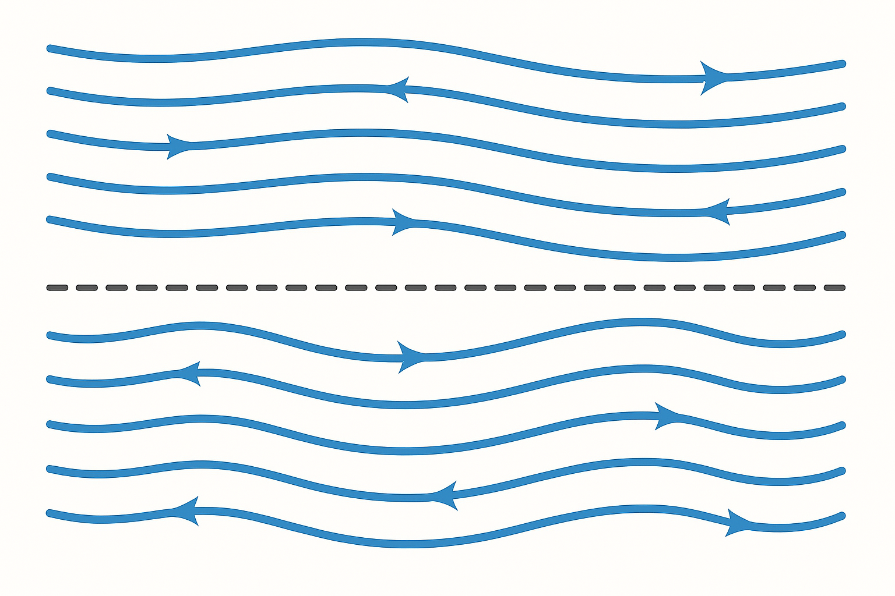

layout: page
title: "The Bernoulli Principle"
categories: Bernoulli Fluids Explainer

# The Bernoulli Principle

## What People Think
Most people believe the Bernoulli Principle says:

* All fast moving fluids have low pressure.
* Any fast moving fluid must have a lower pressure than a slower moving fluid.

In other words, it's a common misunderstanding to think that the Bernoulli Principle allows us to compare the pressures of two different fluid flows.

## TL;DR; What Does Bernoulli Actually Tell Us?

Bernoulli only tells us what's happening in a single, undistrurbed, stream of fluid (a *streamline*).

Within such a streamline:
* Where the flow speeds up, we should expect to find lower pressure compared to where *that same flow* is slower.

The streamline must meet a bunch of conditions (basically, energy can't be added or subtracted) because what's really happening is the that conservation of energy (The first law of thermodynamics). In qualified flows, Bernoulli is just telling us that pressure energy is being converted into velocity, or vise-versa, but ultimatly equalling the same total energy.

## Bernoulli isn't a Force, and it isn't Causal.
Common expressions of the Bernoulli Principle reverse the relationship between pressure and velocity, making people think that high velocity *causes* low pressure.

If you take one thing away from this discussion, then it should be this:

Within a streamline: Fluid flows don't *cause* pressure differentials. It's pressure differentials that cause fluid flows. Pressure *causes* flow.

Therefore in (Bernoulli applicable streamline) there can be flow conditions that cause low pressure, and that low pressure causes flow to speed up. Not the reverse.

Statements like, "Lift is caused by the Bernoulli Effect" thus make no sense. Bernoulli can't *cause* anything.

Lift is caused by pressure differentials.
Some pressure differentials can be predicted/calculated using the Bernoulli Equation.
But the Bernoulli Equation doesn't cauase those pressure differentials to exist in the first place, it just tells us when to expect them and how to compute their values.

## Some More Notes
### Large image

