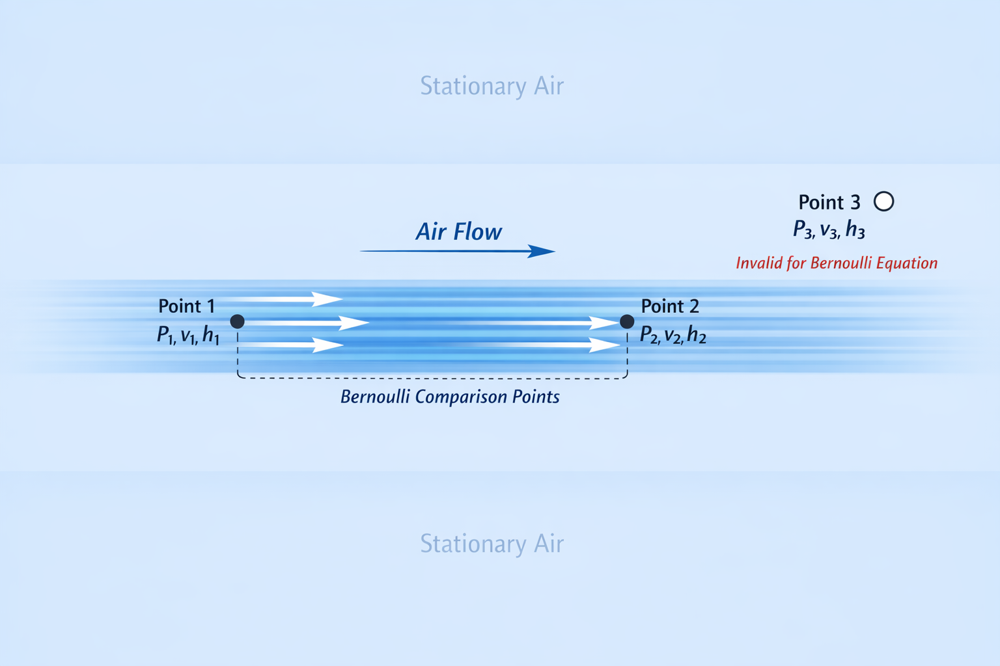

# The Bernoulli Principle

## What People Think
Many people believe the Bernoulli Principle says:

1. Any fast moving fluid must have a lower pressure than a slower moving fluid.
1. Speeding up a fluid causes pressure to drop.
1. The Bernoulli effect causes that pressure drop.

## What Does Bernoulli Actually Tell Us?
Bernoulli's equation is a tool that allows us to compare two points within a single, undisturbed, stream of fluid (a *streamline*).

Within such a streamline:
* Where the flow speeds up, we should expect to find lower pressure compared to where *that same flow* is slower, and vise-versa.

Above, Point 1 and Point 2 are within the same streamline, and you could use the Bernoulli Equation to compare them.

Point 3 is outside of the flow, and you cannot use the Bernoulli equation to compare or predict its attributes.

### Do all fast moving fluids have low pressure?
No. Any given fluid, flowing at any given speed, could be at any possible pressure. You need more information to compare.

A fan in your living room will speed up a fluid and create a stream of higher velocity air flowing through the stationary air. That stream of air will be at the same pressure as the rest of the air in your room.

### Does Speeding Up a Fluid Cause Pressure to Drop?
No. Flow does not _cause_ pressure, pressure _causes_ flow. 

So, this is wrong and backwards:
1. A stream of fluid speeds up.
1. Speeding up causing pressure to drop.
1. Result is a lower pressure zone.

Correct is:
1. A low pressure zone gets created.
1. The low pressure sucks the fluid towards it.
1. The fluid stream speeds up.

### Does the Bernoulli Effect _Cause_ a Pressure drop?
No, the Bernoulli Effect is an observation, not a force. It can't _cause_ a fluid to speed up, or slow down.

As described in the previous paragraph, fluid speeds are controlled by pressure differences, not the reverse.

The Bernoulli Equation and Principle just tells us how the pressures and velocities are correlated.