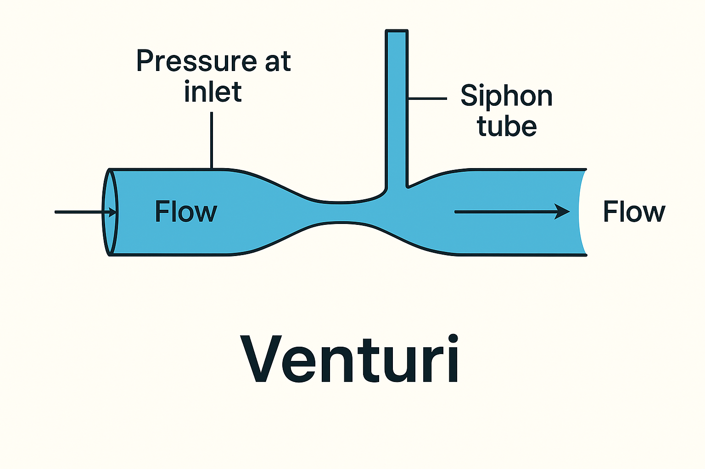
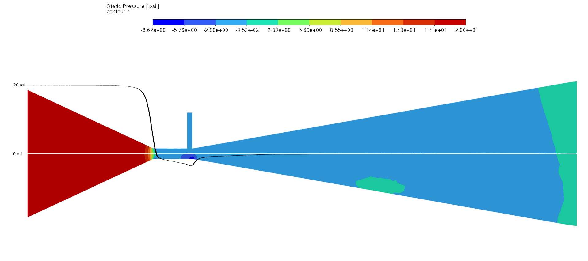
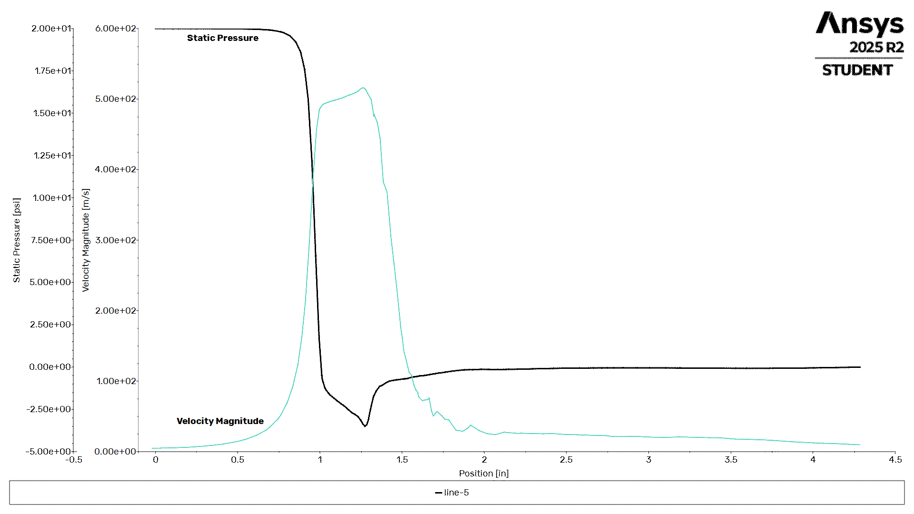

# What is a Venturi

A Venturi is a device that creates a low pressure zone in a fluid by forcing that fluid through a constriction. When going through the constriction, the fluid's velocity increases while it's pressure decreases.

Basically, the fluid's pressure is turned into velocity. This is often referred to as the Venturi effect, and is just conservation of energy.

### A Venturi Checklist:
[X] There is a fluid flowing with some initial pressure.
[x] The fluid flows into a constriction.
[x] The fluid pressure drops in the constriction.
[x] The fluid velocity increases in the constriction.
[x] Optional: If a siphon exists, then the siphon fluid is at a pressure that is higher than the low-pressure in the constriction.

When used as a siphon, it's important to note that the a venturi creates low pressure, which causes suction on the siphon. A pressure differential is the primary mechanism.

## Fluid Analysis of a Venturi
Here is a computational fluid dynamics (CFD) analysis of flow through a venturi. This example has:
* Air entering the Venturi at 20 psig from the left.
* The siphon fluid and the exit of the nozzle are 0 psig (ambient pressure).

Basically, it's what would happen if you grabbed a venturi shaped thing and blew 20 psi air into it while standing in your living room or backyard.

Things to Note:
* Both the colors and the black graph tell us the pressures in the Venturi.
* You can see the working fluid starts at 20 psig, and drops below zero in the constriction.
* The pressure slowly recovers to 0 psig at the nozzle exit.

It should be obvious that with a negative pressure in the constriction, you'll suck fluid into the siphon.

## More Graphs
If you're intrested, this is the full plot of pressure and fluid velocity:

You can see in the two plots how the fluid velocity increases in the constriction, while the pressure decreases, then the reverse happens.